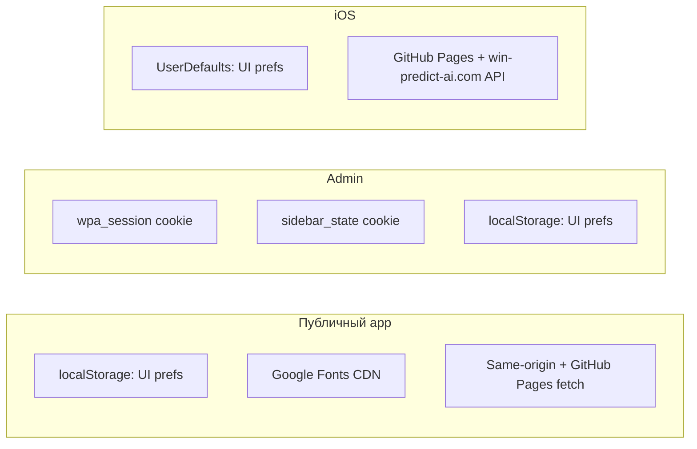

# Анализ необходимости cookie consent (семья win-predict-ai)

Дата: 2026-08-31 (обновлено по review Goal #34)  
Репозиторий-носитель: `win-predict-ai`  
Parent: [onlyzoran/win-predict-ai-orchestrator#34](https://github.com/onlyzoran/win-predict-ai-orchestrator/issues/34)

### Review Goal (2026-08-31)

> «Я думаю стоит сразу сделать, чтобы потом когда понадобится уже было» — onlyzoran

**Влияние на вывод:** формально CMP **не обязателен** при текущем стеке (см. §3), но продуктовое решение — **внедрить consent-инфраструктуру проактивно**, не дожидаясь analytics. Баннер и категории consent готовятся сейчас; подключение метрик сводится к включению категории «Analytics» без переделки UX.

## Краткий вывод

| Поверхность | Cookie consent сейчас | Комментарий |
| --- | --- | --- |
| **Публичный web app** (`win-predict-ai.com/`) | **Не обязателен юридически**, **рекомендуется внедрить** | Нет analytics/рекламы; cookies не ставятся; localStorage — UI-преференсы первой стороны. Спорный внешний запрос — **Google Fonts** (IP уходит на Google). Proactive CMP закрывает fonts-риск и готовит gate под будущие скрипты. |
| **Admin** (`win-predict-ai.com/admin/`) | **Не нужен баннер** | Закрытый инструмент операторов; `wpa_session` — строго необходимая auth-cookie; `sidebar_state` — функциональная UI-cookie после входа. |
| **iOS** | **Не применимо** (нет web-cookies) | Только `UserDefaults` для UI; нет SDK трекинга → **ATT не нужен** сейчас. Privacy policy URL — в follow-up. |
| **Будущее** (analytics, ads, embeds) | **Инфраструктура — сейчас** | CMP на публичном app внедряется до метрик; analytics — только активация категории. |

**Предпочтительный путь (после review):** в ближайших Goal — privacy policy, `CookieConsentBanner` + `useConsent()` в `@onlyzoran/win-predict-ai-ui`, интеграция в app с категориями (Necessary / Preferences / Analytics); Google Fonts — либо self-host Inter, либо загрузка после consent категории «Preferences»; admin/ios без баннера.

---

## 1. Текущее состояние

### 1.1 Публичное приложение (`win-predict-ai`)

**Архитектура:** Vue 3 SPA, статика с `https://win-predict-ai.com/`. Данные: same-origin API (`/api/leagues.json`, `/api/sports`) и JSON с GitHub Pages (`onlyzoran.github.io/win-predict-ai-data`). Auth в app **отсутствует** — пользователь анонимен.

#### Cookies (HTTP)

**Не используются.** В коде app нет `document.cookie`, сервер app не выставляет Set-Cookie (это статический фронт).

#### localStorage / sessionStorage

Все ключи — через `@vueuse/core` `useStorage` (localStorage по умолчанию) или inline bootstrap в `index.html`:

| Ключ | Назначение | Файлы |
| --- | --- | --- |
| `locale` | Язык интерфейса (en, de, fr, es, it, ru) | `src/i18n/index.ts`, bootstrap `index.html` |
| `vueuse-color-scheme` | Светлая/тёмная/auto тема (`useColorMode`) | `index.html`, `src/composables/useColorPalette.ts` |
| `color-palette-preferences` | Палитра light/dark (`{ light, dark }`) | `src/composables/useColorPalette.ts` (`PALETTE_STORAGE_KEY`) |
| `tournamentSort` | Режим сортировки списка турниров | `src/views/HomeView.vue` |
| `pinnedTournaments` | Закреплённые турниры (массив id) | `src/composables/usePinnedTournaments.ts` |
| `hiddenTournaments` | Скрытые турниры (массив id) | `src/composables/useHiddenTournaments.ts` |

`sessionStorage` в app **не используется**.

Bootstrap до монтирования Vue (`index.html`, строки 8–48) читает `locale`, `vueuse-color-scheme`, `color-palette-preferences` для FOUC-free темы и языка.

#### Кэш данных

TanStack Query — **только in-memory** на время сессии вкладки. Persist в localStorage/IndexedDB **не реализован** (см. `docs/data-caching.md`). Service Worker **нет**.

#### Analytics, реклама, трекинг

**Не обнаружено:** нет gtag, GA, Mixpanel, Segment, Hotjar, Sentry browser, PostHog, Facebook Pixel, Clarity и т.п. в `index.html`, `src/`, зависимостях `package.json`.

#### Внешние домены и embeds

| Домен / ресурс | Как подключается | Данные пользователя |
| --- | --- | --- |
| `fonts.googleapis.com` | `@import` в `src/assets/main.css` (Inter) | IP, User-Agent, Referer уходят на Google при загрузке CSS/woff |
| `onlyzoran.github.io` | `fetch` JSON прогнозов (`VITE_DATA_BASE_URL`) | IP GitHub Pages; без cookies от нашего домена |
| `win-predict-ai.com` (same-origin) | `fetch` manifest и sports API | Обычный HTTP; cookies app не ставит |
| `npm.pkg.github.com` | Только **build-time** (`@onlyzoran/*`) | Не в runtime браузера |

CDN embeds (YouTube, Twitter, reCAPTCHA и т.д.) **нет**.

#### Auth-сессии

В публичном app **нет** login/cookie session. Ссылка «Admin» ведёт на `/admin/` (`src/components/AppHeader.vue`).

---

### 1.2 Admin (`win-predict-ai-admin`)

**Архитектура:** Nuxt 3 SPA (`ssr: false`), `https://win-predict-ai.com/admin/`. Magic-link auth, SQLite sessions. Публичные read-only API для фронта app.

#### Cookies (HTTP)

| Cookie | Атрибуты | Назначение | Файлы |
| --- | --- | --- | --- |
| `wpa_session` | `httpOnly`, `sameSite: lax`, `secure` (HTTPS), `maxAge` 30 дней | Auth-сессия оператора | `server/utils/auth.ts` (`SESSION_COOKIE`), `server/api/auth/verify.get.ts`, Nest `api/src/auth/auth.service.ts` |
| `sidebar_state` | **Не** httpOnly, `path=/`, `max-age` 7 дней | Сохранение collapsed/expanded sidebar | `app/components/ui/sidebar/SidebarProvider.vue`, `utils.ts` (`SIDEBAR_COOKIE_NAME`) |

#### localStorage

| Ключ | Назначение | Файлы |
| --- | --- | --- |
| `locale` | Язык | `app/i18n/index.ts` |
| `vueuse-color-scheme` | Light/dark/auto | `useColorMode` в composables |
| `color-palette-preferences` | Палитра | `app/composables/useColorPalette.ts` |

#### Analytics, реклама

**Не обнаружено** в admin UI и server routes.

#### Серверные интеграции (не browser tracking)

| Сервис | Назначение | Где |
| --- | --- | --- |
| Resend (`api.resend.com`) | Magic-link email | `server/utils/mail.ts` — **server-to-server**, браузер пользователя не вызывает |
| Nest sidecar | Proxy sports API | `server/utils/proxySports.ts` — same-origin для браузера |

#### Публичные API без auth

CORS middleware открывает GET для (`server/middleware/cors.ts`):

- `/api/leagues.json` — manifest для app (`server/api/leagues.json.get.ts`)
- `/api/sports` — каталог спортов
- `/api/tournaments` — read (если используется)

Эти эндпоинты **не ставят** tracking-cookies; ответ — JSON.

#### Доступность admin UI

- `/login` — публичная страница (email для magic link)
- Остальные страницы — middleware `auth` → редирект на login (`app/middleware/auth.ts`)
- Admin **не** предназначен для массовой публичной аудитории

#### Шрифты / CDN в admin

Admin **не** тянет Google Fonts напрямую; стили из `@onlyzoran/win-predict-ai-ui` (`app/assets/css/main.css`).

---

### 1.3 Сводка: что реально «пишется» на устройство



---

## 2. iOS (рекомендации, без правок репо)

Native SwiftUI-приложение (`win-predict-ai-ios`). **HTTP cookies как в браузере не применимы.**

### Идентификаторы и хранение

| Механизм | Ключи | Назначение | Файлы |
| --- | --- | --- | --- |
| `UserDefaults` | `locale`, `tournamentSort`, `themeMode`, `lightPalette`, `darkPalette` | UI/appearance | `Stores/AppSettings.swift` |
| `UserDefaults` | `pinnedTournaments` | Закрепления | `Stores/PinStore.swift` |
| `UserDefaults` | `hiddenTournaments` | Скрытые турниры | `Stores/HideStore.swift` |

Keychain, IDFA, IDFV для трекинга, analytics SDK (Firebase, Amplitude и т.д.) — **не используются**.

### Сеть

- `DataBaseURL`: `https://onlyzoran.github.io/win-predict-ai-data/data` (`Info.plist`, `APIConfig.swift`)
- `SportsCatalogURL`: `https://win-predict-ai.com/api/sports`
- `URLSession.shared` — обычные GET JSON (`DataService.swift`)

`NSAllowsArbitraryLoads = true` в `Info.plist` — про ATS, не про tracking.

### ATT / Privacy Manifest / consent

| Требование | Сейчас | Когда понадобится |
| --- | --- | --- |
| **App Tracking Transparency (ATT)** | **Не нужен** — нет cross-app tracking / IDFA | При подключении ads или analytics с tracking (Facebook SDK, AppsFlyer и т.п.) |
| **Privacy Manifest (`PrivacyInfo.xcprivacy`)** | **Отсутствует** | Apple требует для SDK с declared API; добавить при первом analytics SDK или при аудите Required Reason APIs |
| **In-app consent dialog** | **Не нужен** для текущих UserDefaults | Если появится сбор данных «не для работы приложения» (crash reporting с PII, personalized ads) |
| **App Store Privacy Nutrition Labels** | Заполнить при публикации: «Data Not Collected» / «Data Not Linked to You» для текущего профиля | Обновить при добавлении analytics |

**Рекомендация для будущих Goal (ios):** зафиксировать privacy policy URL в App Store; при добавлении Sentry/Crashlytics — manifest + disclosure; ATT только если SDK запрашивает tracking.

---

## 3. Нужен ли cookie consent (правовая и продуктовая оценка)

> Не юридическое заключение. Оценка по фактическому использованию и типичной практике GDPR / ePrivacy (EU), UK GDPR, штатов США с opt-out (CCPA/CPRA — ограниченно для «sale/share»).

### 3.1 Классификация текущих технологий

| Категория | Примеры в win-predict-ai | Consent обычно |
| --- | --- | --- |
| **Strictly necessary** | `wpa_session` (admin login) | **Не требуется** (EU ePrivacy exemption) |
| **Functional / preferences** | localStorage UI keys, `sidebar_state`, iOS UserDefaults | **Спорно:** многие EU-сайты не блокируют, но формально ePrivacy требует согласия на «non-essential» storage; на практике риск низкий без профилирования |
| **Analytics / marketing** | **Отсутствуют** | Требовали бы opt-in (EU) |
| **Third-party content с передачей IP** | Google Fonts CDN | **Повышенный риск в EU** (решения суда DE/NL о передаче IP Google без consent). Mitigation: self-host шрифтов |

### 3.2 По поверхностям

**Публичный app (EU/UK посетители):**

- Полноценный cookie banner **не обязателен** при отсутствии analytics/ads, если устранить или disclosed Google Fonts.
- localStorage для locale/theme/pins — **first-party functional**; при строгой трактовке ePrivacy можно включить в «Preferences» toggle, но отдельный CMP избыточен без marketing cookies.
- **Privacy Policy** (какие данные, GitHub Pages, Google Fonts, contact) — **рекомендуется** для GDPR transparency, даже без баннера.

**Admin:**

- Cookie consent banner **не нужен**: B2B/internal tool, пользователь — приглашённый оператор, session cookie необходима для сервиса.
- Privacy notice может быть во внутренней документации/onboarding.

**iOS (EU/US App Store):**

- Cookie consent **не применимо**.
- ATT **не требуется** без tracking.
- Privacy labels + policy URL — при релизе.

**Юрисдикции:**

| Регион | Актуальность | Вывод |
| --- | --- | --- |
| EU/EEA, UK | Высокая (GDPR + ePrivacy) | Минимум: policy + fonts; CMP — при analytics |
| US (general) | Средняя | Без sale of PI и без детского трекинга — баннер не обязателен; CCPA notice если CA users + «sale/share» |
| RU | Средняя | 152-ФЗ: политика обработки ПДн при сборе; сейчас сбор минимален (нет форм/registrations в app) |

### 3.3 Итоговая шкала

| Вариант | Оценка |
| --- | --- |
| **Обязателен сейчас (strict legal)** | **Нет** (нет non-essential cookies + нет analytics) |
| **Рекомендуется внедрить сейчас (product decision, Goal review)** | Privacy policy + CMP на публичном app: категории готовы, Analytics пустая до подключения метрик; Google Fonts — self-host **или** consent-gated load |
| **Обязателен при расширении без proactive CMP** | Любой EU-facing analytics (GA4, Plausible с cookies, Hotjar), ads, social embeds, A/B SaaS — **не актуально**, если CMP уже развёрнут |

---

## 4. Где добавлять consent

> **После review Goal:** баннер на публичном app внедряется **проактивно**, даже без analytics — см. §6.

| Поверхность | Баннер / CMP | Почему |
| --- | --- | --- |
| **Публичный web app** (`/`) | **Да** — единственное место для EU-facing consent | Анонимные посетители; сюда же analytics |
| **Admin** (`/admin/*`) | **Нет** | Auth-gated; operators; session = necessary |
| **Admin login** (`/admin/login`) | **Нет** | Только email для magic link; без marketing pixels |
| **PR preview** (`/win-predict-ai-preview/...`) | **Опционально** | Тот же код app; можно наследовать поведение prod |
| **iOS** | **Не cookie banner** | ATT / in-app privacy settings только под tracking SDK |
| **Storybook (ui)** | **Нет** | Dev/demo; не production |
| **GitHub Pages (data JSON)** | **Нет** | Статические JSON; не наш UI |

При внедрении analytics: загрузка скриптов **только после** consent; functional localStorage (theme, locale) можно оставить в категории «Essential/Preferences» без блокировки или с отдельным toggle — product choice.

---

## 5. Откуда брать UI для consent

| Вариант | Плюсы | Минусы | Отдельные Goal |
| --- | --- | --- | --- |
| **A. Компонент в `@onlyzoran/win-predict-ai-ui`** | Единый дизайн с app/admin; Storybook; i18n ru/en; WCAG; версионирование npm | Нужен ui release → bump app/admin; больше начальной работы | `ui`: `CookieConsentBanner`, `useConsent`, types; `app`: mount + gate scripts; `admin`: только если появится публичный marketing — скорее **не нужен** |
| **B. OSS (vanilla-cookieconsent, Klaro, cookieconsent v3)** | Быстрый старт; готовые категории GDPR | Чужой visual language (не Nexora); сложнее sync с `@onlyzoran/win-predict-ai-ui`; CSS conflicts с Tailwind 4 | `app`: интеграция + theme override CSS; возможно форк стилей |
| **C. Минимальный inline в app** | Малый diff; без npm ui release | Дублирование если понадобится в admin/marketing site; нет Storybook contract | Только `app`; технический долг при масштабировании |

**Сравнение с учётом review (proactive implementation):**

- **Вариант A — единственный рекомендуемый** для «сделать сразу»: один banner, Storybook-контракт, категории расширяются без смены UX; admin по-прежнему без баннера.
- Вариант C (inline) — отклонён: при proactive rollout быстро превращается в техдолг; при добавлении analytics всё равно потребуется рефакторинг.
- Вариант B (OSS) — отклонён: визуально не Nexora, сложнее i18n и версионирование с `@onlyzoran/win-predict-ai-ui`.

**iOS:** отдельный SwiftUI sheet / Settings link «Privacy» — Goal `ios`, не переиспользует web CMP.

---

## 6. Рекомендация и следующие шаги

### Предпочтительный вариант (proactive, после review Goal)

**Принцип:** consent-инфраструктура разворачивается **до** analytics, чтобы при подключении метрик не переделывать UX и не откладывать compliance.

**Фаза 1 — consent-инфраструктура (ближайшие Goal, параллельно где возможно):**

1. **`win-predict-ai-ui`:** `CookieConsentBanner` + `useConsent()` + типы категорий (`necessary`, `preferences`, `analytics`). Storybook: Accept all / Reject non-essential / Customize. Persist выбора в `localStorage` (ключ, например `cookie-consent-preferences`).
2. **`win-predict-ai`:** интеграция баннера в корневой layout; gate для будущих script injection; mapping:
   - **Necessary (always on):** bootstrap locale/theme (нельзя блокировать без поломки FOUC — disclosed в policy).
   - **Preferences:** `tournamentSort`, `pinnedTournaments`, `hiddenTournaments`; опционально — Google Fonts load (если не self-host).
   - **Analytics (off by default, пустая):** placeholder до выбора vendor.
3. **`win-predict-ai`:** **Privacy Policy** — страница или route + ссылка в footer и в баннере; перечень storage keys, third-party hosts (Google Fonts, GitHub Pages, Resend для admin), контакт.
4. **Google Fonts — один из двух путей** (отдельный Goal или подзадача app):
   - **A (предпочтительно):** self-host Inter — убрать `@import` из `src/assets/main.css`; fonts не требуют consent.
   - **B:** оставить CDN, но загружать CSS только после consent «Preferences» (fallback system font до согласия).

**Фаза 2 — iOS и admin (без web-баннера):**

5. **`win-predict-ai-ios`:** URL privacy policy в App Store metadata; privacy questionnaire («Data Not Collected» для текущего профиля).
6. **Admin:** без CMP; при необходимости — ссылка на policy во внутреннем onboarding (не публичный баннер).

**Фаза 3 — когда product выберет analytics:**

7. **`win-predict-ai-orchestrator`:** decision — vendor (Plausible cookieless vs GA4 и т.д.) + jurisdictions.
8. **`win-predict-ai`:** loader analytics только при `consent.analytics === true`; без изменения баннера.
9. **`win-predict-ai-ios`:** Privacy Manifest + ATT — только если SDK требует tracking.

### Черновой список follow-up Goal (без реализации в этом PR)

| # | Приоритет | Repo | Заголовок (черновик) |
| --- | --- | --- | --- |
| 1 | **P0** | `win-predict-ai-ui` | CookieConsentBanner + useConsent + Storybook |
| 2 | **P0** | `win-predict-ai` | Integrate consent banner + category gate + footer link |
| 3 | **P0** | `win-predict-ai` | Privacy Policy page |
| 4 | **P1** | `win-predict-ai` | Self-host Inter (remove Google Fonts CDN) — *или* fonts consent-gate |
| 5 | **P1** | `win-predict-ai-ios` | Privacy policy URL + App Store privacy questionnaire |
| 6 | **P2** | `win-predict-ai-orchestrator` | Decision: analytics vendor + jurisdictions |
| 7 | **P2** | `win-predict-ai` | Analytics loader (after vendor decision) |
| 8 | **P3** | `win-predict-ai-ios` | PrivacyInfo.xcprivacy (when adding SDKs) |

**Admin** в списке отсутствует — баннер не нужен (§4).

### Что сознательно не делаем в этом PR

- Реализация banner/CMP
- Правки admin, ui, ios
- Подключение analytics
- Изменение runtime-поведения app

---

## Приложение: команды для аудита

Повторить inventory localStorage keys в app:

```bash
rg "useStorage|localStorage" src/ index.html
```

Admin cookies:

```bash
rg "SESSION_COOKIE|SIDEBAR_COOKIE|setCookie|document.cookie" \
  ../win-predict-ai-admin/server ../win-predict-ai-admin/app
```

iOS UserDefaults keys:

```bash
rg "defaultsKey|forKey:" ../win-predict-ai-ios/Win\ Predict\ AI/Stores/
```

---

## Источники в коде (основные)

- App bootstrap storage: `index.html`
- App composables: `src/i18n/index.ts`, `src/composables/useColorPalette.ts`, `usePinnedTournaments.ts`, `useHiddenTournaments.ts`, `src/views/HomeView.vue`
- App external font: `src/assets/main.css`
- App env/URLs: `.env.production`, `deploy/README.md`
- Admin session cookie: `win-predict-ai-admin/server/utils/auth.ts`
- Admin sidebar cookie: `win-predict-ai-admin/app/components/ui/sidebar/SidebarProvider.vue`
- Admin public API CORS: `win-predict-ai-admin/server/middleware/cors.ts`
- iOS stores: `win-predict-ai-ios/Win Predict AI/Stores/*.swift`
- iOS network: `APIConfig.swift`, `DataService.swift`, `Info.plist`
